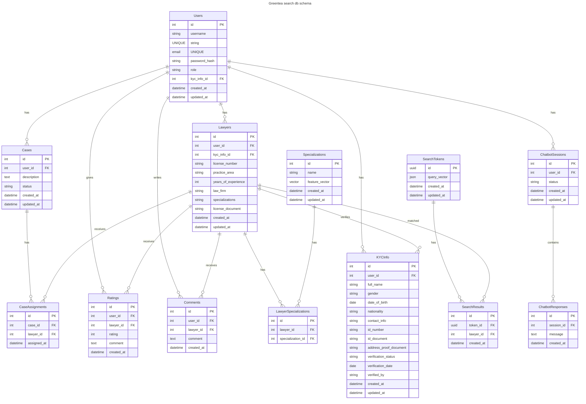

```mermaid
---
title: Greentea search db schema
---
erDiagram
    Users {
        int id PK
        string username UNIQUE
        string email UNIQUE
        string password_hash
        string role
        int kyc_info_id FK
        datetime created_at
        datetime updated_at
    }
    
    Lawyers {
        int id PK
        int user_id FK
        int kyc_info_id FK
        string license_number
        string practice_area
        int years_of_experience
        string law_firm
        string specializations
        string license_document
        datetime created_at
        datetime updated_at
    }
    
    KYCInfo {
        int id PK
        int user_id FK
        string full_name
        string gender
        date date_of_birth
        string nationality
        string contact_info
        string id_number
        string id_document
        string address_proof_document
        string verification_status
        date verification_date
        string verified_by
        datetime created_at
        datetime updated_at
    }
    
    Specializations {
        int id PK
        string name
        vector feature_vector
        datetime created_at
        datetime updated_at
    }
    
    LawyerSpecializations {
        int id PK
        int lawyer_id FK
        int specialization_id FK
    }
    
    Cases {
        int id PK
        int user_id FK
        text description
        string status
        datetime created_at
        datetime updated_at
    }
    
    CaseAssignments {
        int id PK
        int case_id FK
        int lawyer_id FK
        datetime assigned_at
    }
    
    Ratings {
        int id PK
        int user_id FK
        int lawyer_id FK
        int rating
        text comment
        datetime created_at
    }
    
    Comments {
        int id PK
        int user_id FK
        int lawyer_id FK
        text comment
        datetime created_at
    }
    
    ChatbotSessions {
        int id PK
        int user_id FK
        string status
        datetime created_at
        datetime updated_at
    }
    
    ChatbotResponses {
        int id PK
        int session_id FK
        text message
        datetime created_at
    }
    
    SearchTokens {
        uuid id PK
        json query_vector
        datetime created_at
        datetime updated_at
    }
    
    SearchResults {
        int id PK
        uuid token_id FK
        int lawyer_id FK
        datetime created_at
    }
    
    Users ||--o{ Lawyers: "has"
    Users ||--o{ Cases: "has"
    Cases ||--o{ CaseAssignments: "has"
    Lawyers ||--o{ CaseAssignments: "receives"
    Users ||--o{ Ratings: "gives"
    Lawyers ||--o{ Ratings: "receives"
    Users ||--o{ Comments: "writes"
    Lawyers ||--o{ Comments: "receives"
    Users ||--o{ ChatbotSessions: "has"
    ChatbotSessions ||--o{ ChatbotResponses: "contains"
    Lawyers ||--o{ LawyerSpecializations: "has"
    Specializations ||--o{ LawyerSpecializations: "has"
    Users ||--o{ KYCInfo: "has"
    Lawyers ||--o{ KYCInfo: "verifies"
    SearchTokens ||--o{ SearchResults: "has"
    Lawyers ||--o{ SearchResults: "matched"


```
