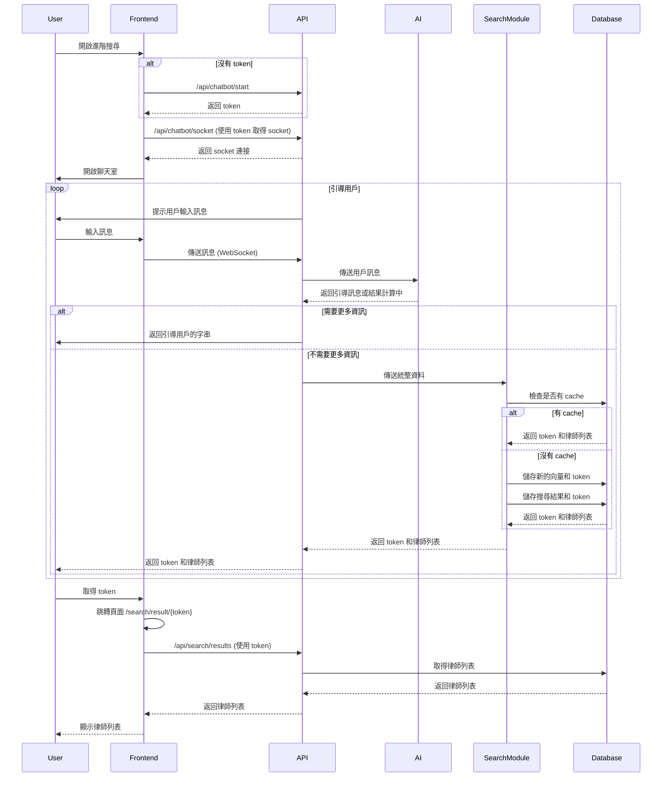

## 進階搜尋功能大綱

### 功能概述

進階搜尋功能旨在通過聊天機器人一步一步引導用戶描述案情需求，並根據用戶輸入的資訊計算出合適的律師列表。這個功能適合對自己的需求不確定的用戶，通過聊天機器人的提示逐步收集信息。

### API 設計

1. 開始進階搜尋 API

   - URL: `/api/chatbot/start`
   - 方法: `POST`
   - 描述: 開始新的進階搜尋會話，返回 token。

   Reponse

   ```json
   {
     "status": "success",
     "token": "123e4567-e89b-12d3-a456-426614174000"
   }
   ```

2. 接收用戶訊息 API (WebSocket)

   - URL: `ws://{domain}/socket`
   - 方法: `WebSocket`
   - 描述: 接收用戶訊息，處理並返回引導訊息或結果計算中。

   請求範例:

   ```json
   {
     "type": "start",
     "token": "123e4567-e89b-12d3-a456-426614174000"
   }
   ```

   請求範例:

   ```json
   {
     "type": "user_message",
     "message": "我今天被某某人打，我想要告他，我在台北"
   }
   ```

   回應範例 (需要更多資訊):

   ```json
   {
     "type": "bot_message",
     "message": "請問您有沒有受傷？"
   }
   ```

   回應範例 (結果計算中):

   ```json
   {
     "type": "bot_message",
     "is_success": true,
     "message": "我們正在計算您的結果，請稍候..."
   }
   ```

   回應範例 (可能的可以的訊息):

   ```json
   {
     "type": "bot_message",
     "message_status": "items",
     "message": [
       {
         "id": 1,
         "message": "我受傷了"
       },
       {
         "id": 2,
         "message": "我有財務的困難"
       }
     ]
   }
   ```

   回應範例 (結果 token)

   ```json
   {
     "type": "bot_message",
     "message_status": "result_token",
     "message": "123e4567-e89b-12d3-a456-426614174000"
   }
   ```

### 說明

1. 確認用戶是否有 token
   - 使用 localstorage 檢查用戶是否有 token。
2. 開啟聊天室
   - 如果沒有 token，使用 /api/chatbot/start 取得聊天室的 token。
   - 根據 token 取得聊天室的 socket 連接。
3. 聊天機器人引導用戶
   - 主動引導用戶，給出初始提示和輸入選項。
4. 用戶輸入訊息
   - 用戶在聊天室中輸入訊息。
5. 後端處理訊息
   - 後端接收到訊息後，將資料送到 AI，整理出更多資訊。
   - AI 判斷是否需要更多資訊。
     - 如果需要更多資訊，回傳引導用戶的字串，繼續引導。
     - 如果不需要更多資訊，回傳結果進行計算。
6. 計算結果
   - 將統整的資料送入 search module 計算用戶的分類向量和最接近的律師列表。
   - 如果 cache 中已存在分類，則直接從 DB 取得。
7. 結束聊天機器人
   - 跳轉頁面到 /search/result/{token}，用 token 交換律師列表資料。
8. 顯示搜尋結果
   - 使用 token 取得律師列表的資料，顯示搜尋結果。


