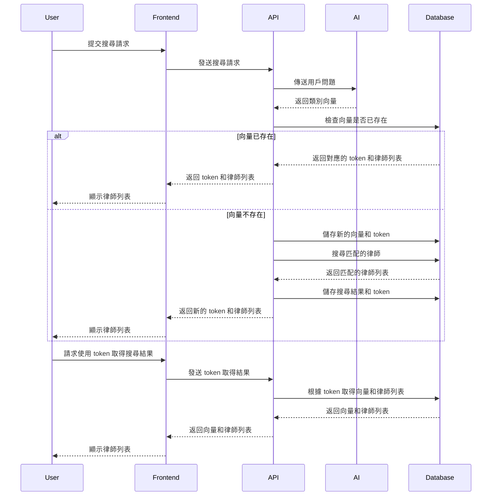

## 說明

GREENTEA SEARCH 搜尋功能基於 AI 生成的類別向量計算結果，並將搜尋結果快取到資料庫中。這樣的設計既能提高效率，減少重複計算，又能保證相同的輸入會得到相同的輸出結果。

1. 用戶提交搜尋請求：
   - 用戶在前端提交搜尋請求，前端將請求發送到 API。
2. AI 計算類別向量：
   - API 將用戶問題發送給 AI，AI 返回計算出的類別向量。
3. 檢查向量是否已存在：
   - API 檢查資料庫中是否已存在該向量。
   - 如果向量已存在：
     - 資料庫返回對應的 token 和律師列表。
     - API 將 token 和律師列表返回給前端。
     - 前端顯示律師列表給用戶。
   - 如果向量不存在：
     - API 將新的向量和 token 儲存到資料庫。
     - API 在資料庫中搜尋匹配的律師，返回匹配的律師列表。
     - API 將搜尋結果和 token 儲存到資料庫。
     - API 將新的 token 和律師列表返回給前端。
     - 前端顯示律師列表給用戶。
4. 使用 token 取得搜尋結果：
   - 用戶請求使用 token 取得搜尋結果。
   - 前端發送 token 請求結果到 API。
   - API 根據 token 從資料庫中取得向量和律師列表。
   - API 將向量和律師列表返回給前端。
   - 前端顯示律師列表給用戶。

## 實作項目

1. 建立資料表

   - `SearchTokens`
   - `SearchResults`

2. 設計並實作 API

   - 搜尋請求 API

     - URL: `/api/search`
     - 方法: `POST`
     - 描述: 處理用戶提交的搜尋請求，計算類別向量，搜尋匹配的律師並返回結果。

       `request`:

       ```json
       {
         "query": "我是XXX，今天發生YYY，我想要ZZZ，我住在***"
       }
       ```

       `response`:

       ```json
       {
         "status": "success",
         "token": "123e4567-e89b-12d3-a456-426614174000",
         "query_vector": {
           "刑法": 0.7,
           "告發": 0.9,
           "台北": 0.9
         }
       }
       ```

   - 取得搜尋結果 API

     - URL: `/api/search/results/{token}`
     - 方法: `GET`
     - 描述: 根據 token 取得對應的搜尋結果。

       `request`:

       ```json
       {
         "token": "123e4567-e89b-12d3-a456-426614174000"
       }
       ```

       `response`:

       ```json
       {
         "status": "success",
         "query_vector": {
           "刑法": 0.7,
           "告發": 0.9,
           "台北": 0.9
         },
         "results": [
           {
             "lawyer_id": 3,
             "name": "王律師",
             "specializations": ["刑法", "告發", "台北"],
             "contact_info": "0922-789-123"
           },
           {
             "lawyer_id": 4,
             "name": "陳律師",
             "specializations": ["刑法", "台北"],
             "contact_info": "0933-987-654"
           }
         ]
       }
       ```

3. AI 類別向量計算

   - 與 AI 服務進行整合

4. 向量比對邏輯

   - 計算向量距離，找到最匹配的律師

5. 結果快取

   - 將向量和對應的律師列表快取到資料庫

6. 前端集成

   - 與前端進行 API 集成，實現用戶體驗


