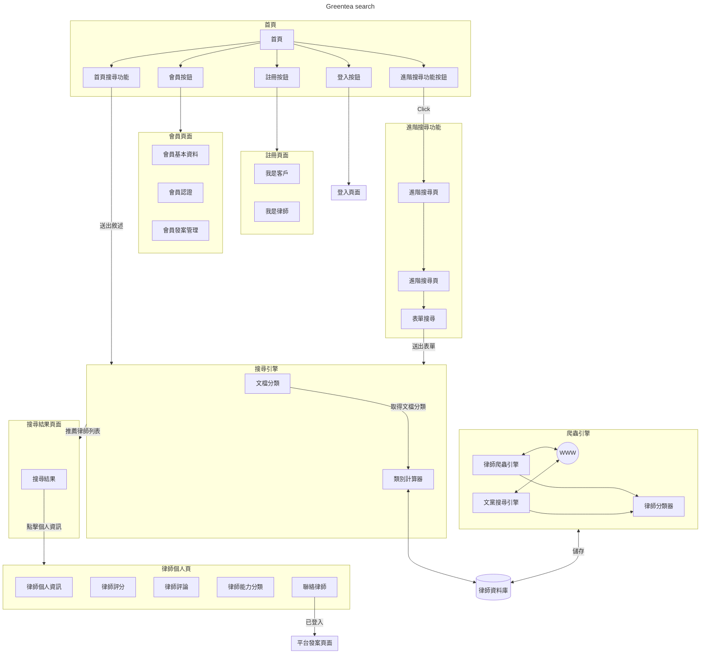

# GREENTEA SEARCH

## 系統架構

MVP:

`首頁搜尋功能`、`搜尋引擎`、`爬蟲引擎`、`搜尋結果頁`、`律師個人頁`

```mermaid

---
title: Greentea search
---
flowchart TD
    WWW((WWW))
    subgraph 首頁
        index[首頁] --> index_search[首頁搜尋功能]
        index[首頁] --> index_advancedSearchButton[進階搜尋功能按鈕]
        index[首頁] --> index_loginButton[登入按鈕]
        index[首頁] --> index_signupButton[註冊按鈕]
        index[首頁] --> index_memberButton[會員按鈕]
    end

    index_loginButton-->登入頁面

    subgraph 登入頁面
    end


    index_signupButton-->註冊頁面

    subgraph 註冊頁面
        forClient[我是客戶]
        forLawyer[我是律師]
    end

    index_memberButton-->會員頁面

    subgraph 會員頁面
        memberProfile[會員基本資料]
        memberAuth[會員認證]
        caseManager[會員發案管理]
    end


    index_advancedSearchButton--"Click"-->advancedSearch
    index_search--"送出敘述"-->搜尋引擎

    subgraph 進階搜尋功能
        advancedSearch[進階搜尋頁]
        -->advancedSearch_stagedChatBot[階段式詢問]
        advancedSearch_stagedChatBot[進階搜尋頁]
        -->advancedSearch_formSearch[表單搜尋]
    end

    advancedSearch_formSearch--"送出表單"-->搜尋引擎
    搜尋引擎--推薦律師列表-->搜尋結果頁面

    subgraph 搜尋引擎
        searchEngine_classificationSystem[文檔分類]--"取得文檔分類"-->
        searchEngine_categoryDistanceCalculator[類別計算器]

    end

    subgraph 爬蟲引擎
        lawyerSearchEngine[律師爬蟲引擎]<-->WWW
        documentSearchEngine[文黨搜尋引擎]<-->WWW
        lawyerSearchEngine---->lawyerClassifier[律師分類器]
        documentSearchEngine---->lawyerClassifier[律師分類器]
    end


    爬蟲引擎 <--"儲存"--> DataBase

    searchEngine_categoryDistanceCalculator<-->DataBase[(律師資料庫)]


    subgraph 搜尋結果頁面
        searchResult[搜尋結果]

    end

    searchResult--點擊個人資訊-->律師個人頁

    subgraph 律師個人頁
        lawyerDetail[律師個人資訊]
        lawyerRank[律師評分]
        lawyerComments[律師評論]
        lawyerClassification[律師能力分類]
        contactLawyer[聯絡律師]
    end

    contactLawyer--已登入-->平台發案頁面
    subgraph 平台發案頁面


    end
```
