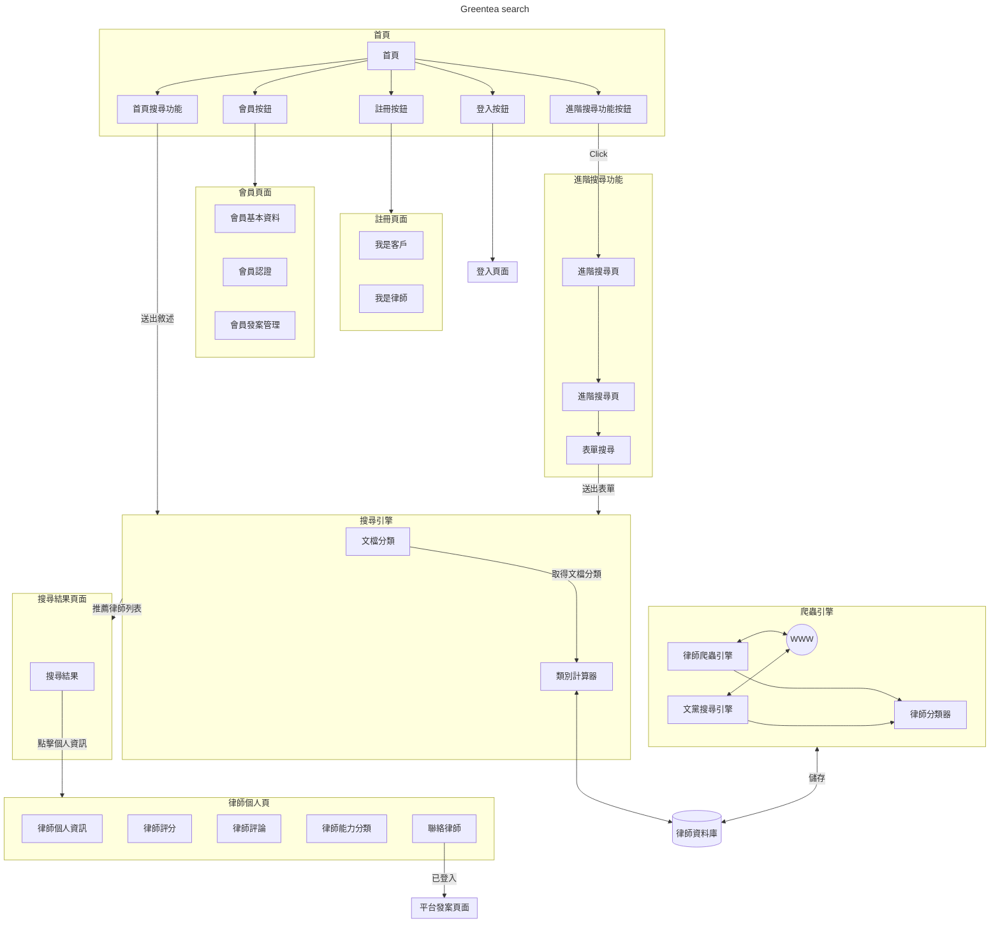

# GREENTEA SEARCH

## 題目名稱： 律查表、蘭律找…

## 概述

一個律師媒合平台，用戶可以輸入自己的案情，平台會根據案情自動分類，並且媒合到適合的律師。並且根據體驗對律師評分。

對於法律工作者（律師/代書等）可以註冊平台編輯自己的商務頁面、經營自己專頁、下廣告曝光等。

如果用戶願意公開也可以公開自己的需求，讓法律工作者主動接洽用戶、可能提供簡單的諮詢或法律服務。

額外增加論壇功能，讓用戶之間可以互動、討論法律相關的問題。

## 緣起

由於過去找律師時時常不知道每個律師的專長，實務上每個律師的擅長領域的專業差距其實很大，但用戶需要做很多功課才能找到適合的律師，對於資源不足的用戶更是困難，甚至很多一般人連自己的問題是否需要找律師、要找什麼類型的律師都不知道。

對於律師來說開業找到案源也是十分仰賴於人脈的事情，有了平台輔助對於律師單獨結案的成本也會大幅度下降，讓律師只要專注在案件及專業，業務的事情交給平台負責。

## 專案技術簡述

- 透過爬蟲技術查閱律師的卷宗可以取得大量律師的資料，並且透過 ai 分類不同律師的專長

- 可以透過公開資訊直接串連到律師的聯絡資訊。可以解決平台初期沒有律師註冊的問題。

- 用 ai fine tuning 可以快速分類用戶的案件類型，並且再用 ai 透過分類及案情找到適
  合的律師。
- 用一些成熟的網路技術實作「律師個人專頁」、「媒合平台」、「論壇」等等的功能

## 系統架構

MVP:

`首頁搜尋功能`、`搜尋引擎`、`爬蟲引擎`、`搜尋結果頁`、`律師個人頁`

